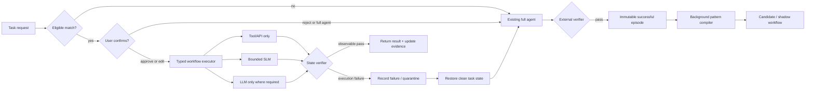

# Architecture

## Online path



Observation is cheap and always on. `BackgroundWorkflowLearner` puts normalized
episodes on a queue. Expensive workflow synthesis only happens after a verified
success and can be placed behind a recurrence threshold in a production worker.

## Data contracts

- `TaskEpisode`: instruction, scope, variables, outcome, verification status,
  cost metadata, and normalized tool calls.
- `WorkflowDefinition`: typed variables, ordered steps, data-flow references,
  required tool contracts, examples, negative examples, version, and statistics.
- `WorkflowProposal`: workflow, match decomposition, extracted values, missing
  values, and a serializable confirmation payload.
- `ExecutionResult`: actual step traces, executor tiers, verifier result, cost,
  error, and escalation flag.

Values such as `$input.new_start` and `$steps.find_event.id` make learned data
flow explicit and auditable. Tool calls are deterministic once arguments are
bound. Only `compute.*` steps may use a model.

Execution fails closed before invoking tools when there is no outcome verifier,
when a required tool contract has no learned schema hash, or when the current
schema hash differs. A failed workflow reports whether side effects may already
have occurred; callers must restore a clean task state before full-agent
fallback.

The workflow IR is deliberately restricted instead of embedding arbitrary
generated Python. In addition to tool and bounded-compute steps it supports:

- pagination with an explicit page argument, stop signal, and maximum bound;
- foreach over a materialized collection with a maximum item count;
- filters using an allow-listed predicate DSL;
- deterministic reducers such as unique, count, sort, and top-k;
- branches with explicit then/else subprograms.

Nested steps retain tool-schema contracts and globally unique step IDs. A loop
that reaches its bound without a stop signal fails closed, making incomplete
work visible rather than returning a plausible partial result.

## AppWorld fallback and evaluator isolation

The treatment runner uses two verification boundaries. Observable completion
(`task_completed`) may trigger a clean-world fallback when execution itself
fails. The official AppWorld evaluator is called only after a completed attempt
and supplies the reported score. An official-evaluator failure never selects a
second attempt, so hidden benchmark feedback cannot become a test-time oracle.

Fallback destroys the attempted world and constructs a new `AppWorld` for the
same task and experiment. Reinitialization restores the input DB and also
replaces the requester, API wrappers, Python namespace, counters, and frozen
clock. Tests assert that the workflow and fallback agents receive distinct
world identities.

## Research phase state machine

`ProtocolGuard` is the only benchmark-facing mutation boundary:

```text
train: compile + calibrate -> dev: calibrate only -> seal -> test: read-only
```

The seal hashes both executable programs and full workflow state. Test validates
the protocol, source commit, program digest, and state digest before and after
execution. Test evaluator outcomes and execution statistics are not written
back to procedural memory.

## Two independent confidence signals

Pattern support answers “have we seen the same procedure repeatedly?” Execution
reliability answers “does the compiled procedure work on new inputs?” They are
not combined into one misleading count:

- three verified source episodes promote a candidate to shadow by default;
- three confirmed, verified shadow executions at >=90% observed success and an
  adequate Wilson lower bound promote it to active;
- two consecutive failures quarantine it;
- `ResearchPromotionPolicy` uses materially stricter thresholds.

## Computation routing

The compiler assigns the minimum observed/validated tier per compute step:

```text
deterministic function -> SLM -> LLM -> full agent
```

`fallback_executors` supplies the upward safety ladder. Downward movement is
allowed only through a new workflow version and shadow evaluation. This avoids
silently replacing a capable model based on one lucky example.

## Scaling boundary

SQLite WAL and the background thread are the local reference deployment. The
core depends on `WorkflowStore` and `ComputeBackend` protocols, so production
systems can use a transactional database, a durable event stream, and separate
compiler workers without changing routing semantics. Episode IDs make ingestion
idempotent; workflow versions make updates auditable.

The next production store should use PostgreSQL with row/version locking, while
high-volume episode ingestion should use Kafka, Pub/Sub, or the application's
existing queue. A vector index is optional: exact structural signatures and
typed contracts remain the first-stage safety filter.
